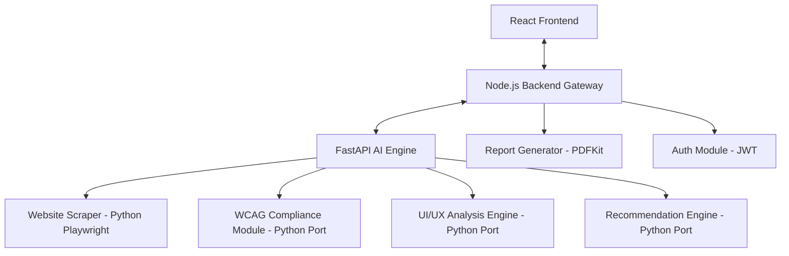

# Project Architecture Plan: AI-Driven Website UI Enhancement System

## 1. System Architecture Overview
The system is transitioning from a Node.js-only prototype to a **Multi-Service Architecture** for better scalability and ML integration.

### 🏗️ Target Component Diagram

## 2. Current Status (V0 Prototype)
- [x] **Core Scraper**: Basic Playwright-based scraper in JS.
- [x] **Rule Engines**: Initial WCAG and Design rules implemented in JS.
- [x] **AI Fixer**: OpenAI integration in JS.
- [x] **Basic API**: `/audit` and `/health` endpoints.

---

# Implementation Task List (Phased Rewrite)

## Phase 1: Architecture Migration (FastAPI Setup)
- [x] **1.1 Setup Python AI Service**
    - [x] Initialize `ai_service/` directory and virtual environment.
    - [x] Setup FastAPI with Uvicorn.
- [x] **1.2 Migrate Scraper logic to Python**
    - [x] Port `scraper.js` logic to Python Playwright.
    - [x] Ensure CSS computed styles and bounding boxes are extracted.
- [x] **1.3 Port Rule Engines to Python**
    - [x] Port `wcagRules.js` (Contrast ratio, font size, missing text).
    - [x] Port `designRules.js` (Spacing, font scales, color consistency).
- [x] **1.4 Refactor Node.js to Gateway Mode**
    - [x] Setup `FastAPIClient` in Node.js to proxy requests.

## Phase 2: Authentication & User Management (Node.js)
- [x] **2.1 Implement User Registration**
    - [x] `POST /api/auth/register` with `bcryptjs`.
- [x] **2.2 Implement JWT Login**
    - [x] `POST /api/auth/login` returning Bearer token.
- [x] **2.3 Route Protection**
    - [x] Apply `verifyToken` middleware to all `/audit` routes.
- [ ] **2.4 User Profiles (Optional)**
    - [ ] Basic profile management.

## Phase 3: AI Engine - Advanced Extraction & Analysis (FastAPI)
- [x] **3.1 Heading Hierarchy Validator**
    - [x] Implement nested H1-H6 sequence validation.
- [x] **3.2 Interactive Element Accessibility**
    - [x] Check for keyboard focusability (tabindex) and aria-labels.
- [x] **3.3 Image Alt-Text Validation**
    - [x] More robust alt-text quality checks.
- [x] **3.4 Issue Severity Classification**
    - [x] Centralize severity logic (Critical/High/Medium/Low).

## Phase 4: Recommendation Engine & Real-Time Preview
- [x] **4.1 Intelligence Recommendation Generator**
    - [x] Refactor AI prompt for better structural fixes.
- [x] **4.2 Style Injection Payload (FR08)**
    - [x] Generate a CSS/JSON payload that the frontend can apply as an "overlay".
- [x] **4.3 Before/After Comparison Data**
    - [x] Prepare specific data structures for side-by-side view (Scoring Engine).

## Phase 5: Report Generation Module (Node.js)
- [x] **5.1 PDF Generation with PDFKit**
    - [x] Create a professional report template with scores and issue charts.
- [x] **5.2 HTML Export**
    - [x] Generate a self-contained HTML report.
- [x] **5.3 Export Endpoints**
    - [x] `GET /api/audit/:id/report/pdf`.
    - [x] `GET /api/audit/:id/report/html`.

## Phase 6: Frontend Integration & Final Polish
- [ ] **6.1 Connect React Frontend to Gateway**
    - [ ] Update API base URLs and integrate Auth tokens.
- [ ] **6.2 Real-time Progress Updates**
    - [ ] Implement simple status polling (e.g., "Scraping...", "Analyzing...").
- [ ] **6.3 Admin Dashboard (FR10)**
    - [ ] Basic log monitoring and user tracking.
- [ ] **6.4 Performance & Scalability Test**
    - [ ] Ensure 10-15s response time target is met.
